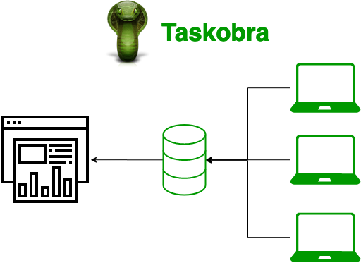

# Taskobra
## A Process Monitor for the Era of Distributed Computing
#### Authors Tom Manner, Miguel Nistal
#### MIT License, 2020

Whether you're a sys-admin or an enthusiast with a seperate gaming and movie hosting PC, Taskobra provides insights and analytics across all your host machines.

## Problem Statement
Without enterprise grade infrastructure it can be difficult to monitor more than one host, but in an age where even our pockets have computers, everyone owns multiple systems. The mainstream task managers are focused on providing you information about the host that you're currently _on_ not the hosts you have all over your house. Many users have a laptop, an at home desktop, and some even have a few servers in the cloud to keep an eye on!

Taskobra is designed to provide insights and metrics for users in the modern era of computing, no matter where your computers are.

## Architecture

Taskobra is made up of three main components:

#### Front-end Web Service
- This is where the user interacts with data in a one stop shop
- It's designed to be simple, intuitive, and allows users to interact with their data in their favorite browser without any additional software

#### Database and Metrics Backend
- The datamodel for Taskobra and how all the data is stored
- The daemon connects directly to this service and passes data through to be displayed on the frontend
- This is a centralized server that all of the local daemons can write to

#### Local Monitoring Daemon
- The daemon is where Taskobra get's its distributed nature
- It's an easy to deploy Python monitoring system, that can be hooked into a Windows startup service or a Linux systemd call

## Contents
- [Web-based UI](webui.md)
- [Metrics](metrics.md)
- [Authentication](auth.md)
- [Deployment Model](deployment.md)
- [Contributing](contributing.md)
- [References](references.md)
