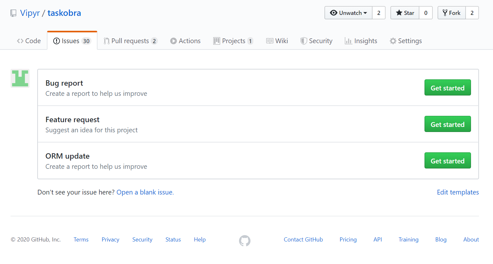
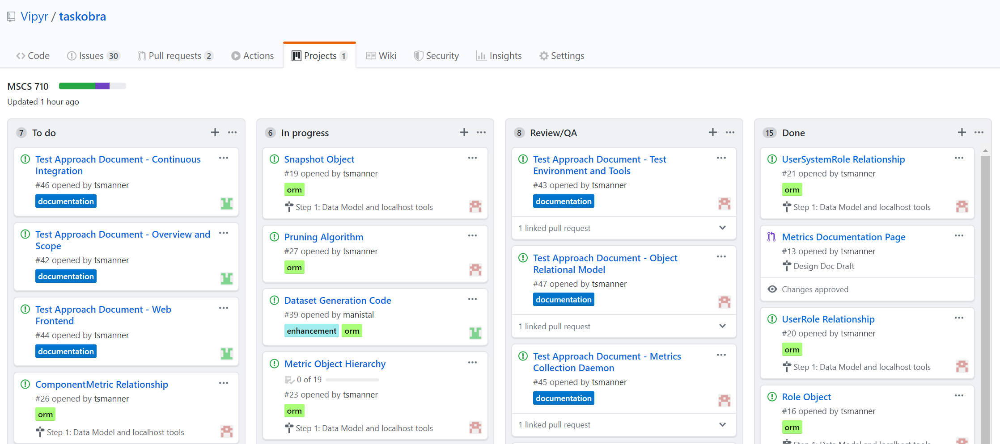

# Test Approach

## Contents
- [Overview and Scope](#overview-and-scope)
- [Test Environment and Tools](#test-environment-and-tools)
- [Test Approach](#test-approach)
  - [Object Relational Model](#object-relational-model)
  - [Metric Collection Daemon](#metric-collection-daemon)
  - [Web Frontend](#web-frontend)
- [Bug Reporting](#bug-reporting)
- [Continuous Integration](#continuous-integration)

## Overview and Scope 

Taskobra is an application designed to monitor process metrics and report them to the user. This application is comprised of three major components that need to be individually verified:

- Object Relational Model
- Web Frontend GUI 
- Process Metrics Daemon

Each of these components need to be tested invidually, and that testing is broken down into both Unit Testing and Function Testing. Due to the modular nature of the application, the test stack will include Unit Tests, Function Tests, and Integration Tests. 

The Unit Testing portion is designed to allow developers to quickly iterate and receive feedback on subcomponents within each major component of the application. These tests will focus on code correctness and are written in conjunction with the development of the functions themselves. These tests are also easy to automate using native Python tooling and will be included in the Continuous Integration processes for the application development. 

Function testing will aim to test boundaries between the major components. These tests will use constructs such as automated data generation to mock the functionality of one or more components not included in the test. These are designed to allow a dedicated tester to examine specific functionality of the application such as usability. 

Integration testing for this application will essentially be deployment-type testing, where a dedicated tester will attempt to use all three major components in conjunction as documented in the Getting Started documentation. 

Several aspects of test are currently out of scope for this document and process, such as Platform Specific Test and Cloud Deployment Testing, due to a lack of resources. Platform Test would decrease the risk with respect to individual platform deployments, such as non-native Python installs on Windows, or Homebrew Python installs on Mac OSX, whose non-native installation proceses could cause variations in runtime experience. Cloud Deployment Testing would provide confidence in the use of common cloud providers such as AWS and Azure when using the distributed functionality of the application. All testing will be completed on a single machine, which exposes much of the distributed components to network connectivity, latency, and configuration escapes. 

## Test Environment and Tools

`taskobra` is tested primarily using Python's builtin `unittest` library.  Since it's part of the standard library, there is no additional setup required to run the test suite.  To ensure proper isolation, we recommend using a virtual environment, pip installing `taskobra` in "editable" mode there, then running the unittests.

Testing against multiple python versions is both important, and can be difficult to manage manually.  To solve thise problem, `taskobra` uses [`tox`](https://tox.readthedocs.io/en/latest/) to manage them declaratively.  This allows both our CI/CD platform and developers to easily execute the same test suites in identical environments.

Install `virtualenv`
```
$ pip install virtualenv
```
Install `tox`
```
$ pip install tox
```
Clone and start testing!
```
$ git clone https://github.com/<username>/taskobra
$ cd taskobra
$ tox
```

## Test Approach

### Object Relational Model

The ORM has two main components, the Objects and the Relationships.  To test that our ORM is working properly, we have to test certain properties for each of these types.  For Objects, we must ensure that they are initialized with sane values, can modified in place, and that an object inserted into the database can be positively identified when queried back out.  For Relationships, we must ensure that they propagate through all related objects on database insertion of an Object, and that when an Object in the graph of Relationships is queried out, all other related objects are as well.

### Metric Collection Daemon

The metric collection daemon has two parts to test.  First is the collection of metrics, where each metric must be tested on each supported platform.  Second is the reporting of these metrics, in the form of a Snapshot, to the database.  This can be accomplished by mocking the metric collection functions, replacing them with deterministic sequences, and then checking that the expected snapshot data can be retrieved from the database.

### Web Frontend 

#### Unit Tests 

Unit testing for the `taskobra.web` package is done using the builtin Python `unittest` module. Testing the Frontend component of the application is unique in that we can't test intangibles such as page layout effectively, so instead the goal here is to ensure that the requests themselves do not throw and that the response types and HTTP codes are correct for a well behaved web application. 

To accomplish this Flask, the webframework being used in the development of Taskobra, provides a 'test client' context manager that allows a unit test to perform requests against the web service as if it was running under the actual WSGI server. More information about the test client can be found in the [Flask Documentation](https://flask.palletsprojects.com/en/1.1.x/testing/).

The base class for the web frontends unit tests is called 'WebTestCase' found in the `tests.web` package of the source code and handles shared setup and teardown code such as calling the `create_app()` factory to get an instance of a Taskobra Flask App. 

The app itself is used in the individual unit tests employing the test_client to make requests against the service, for example:

```python
def test_home_route(self):
    with self.app.test_client() as client:
        rsp = client.get('/')
        assert rsp.content_type == 'text/html; charset=utf-8'
        assert rsp.status_code == 20
```

The context provides the test client object which has all the HTTP verbs implemented (GET and POST are the two we're interested in for Taskobra). The unit tests make the request against the client and then test the two key asserts referred to earlier: the content type and the HTTP response code. If the application throws, because its running within the same interpreter, the throw will be handled by the unit test framework and an error will be registered to verify the code itself is well behaved regardless of the service return values. 

#### Function Tests

Function test for the web frontend takes advantage of the package's `__main__` entry point. The entry point is invoked using the native Python3 module invocation:

```shell
python3 -m taskobra.web
```

Using this method of running is not used in production, which instead uses a WSGI file in conjunction with Nginx to serve the web service. This allows the main module to be overloaded with function test specific code which can allow the tester to more coherently interact with the service. 

The goal of the function test here is to test the usability and function of the GUI itself, so the test application needs to be instantiated with a database with which it can populate the graphs and tables on the page. This is approached using a context manager:

```python
with TestDatabase(f"sqlite:////tmp/taskobra.{os.getpid()}.sqlite.db", fake_systems_generator):
    app = create_app()
    app.run(host='localhost', debug=True)
```

The `TestDatabase()` context manager is defined in the `tests.utils` package in the source code. It constructs a database connection using the URL provided in the constructor and populates it using the generator provided as a predicate to the second argument. The generator function is expected to return database objects from the `taskobra.orm` package which are added to the session context and committed once the generator no longer yields. It also sets the Environment variables used in the deployment of the web application to provide the application with the database URI natively within the context manager, so the application factory does not need to be modified for test.  

The result is a Flask webserver running in debug mode on localhost. The dedicated tester can now interact with the interface at `localhost:5000/` on their browser of choice and inspect the page layout and coherency of the data representation. Developers can also use this to view and iterate on changes to the UI itself where some changes are very intangible such as CSS updates. 

### Bug Reporting

Bug reporting is key piece of the testing process. For Taskobra, bug reporting is done via GitHub Issues with a number of templates available based on the component being selected. Bugs can be opened by anyone, including contributors and users themselves, directly to the GitHub Issues queue. 



Issues are then triaged using the GitHub Project, alongside pending features and enhancements. There are four stages issues can exist in: ToDo, In Progress, Review/QA, and Done. Issues are prioritized in ToDo and then progress through the stages as they're worked on. 



There is an expectation that contributors include unit tests for any new features as part of a pre-requisite to their content being accepted into the main trunk. 

## Continuous Integration

Contributions to the main fork of the application are gated by Continuous Integration. CI provides an effective and automated way to quality control incoming content to the project leveraging the unit testing framework.

For Taskobra, the Continuous Integration platform used is Travis and it's native integration with public GitHub. Taskobra is a relatively small scale Python application, which makes a free and self-contained solution like Travis ideal. Travis is instantiated for the project by authenticating as the Vipyr organization, where Taskobra's root fork is hosted, in the Travis web application. Any branch that contains the file `.travis.yml` in the root of the repository will have CI enabled, including on pull requests. 

The configuration for the CI given by the `.travis.yml` is used to emulate our Test Environment described previously. 

```yaml
dist: xenial

language: python

python:
  - "3.7"

install:
  - pip install tox

script:
  - tox
```

The Operating system used in the CI environment is Ubuntu Xenial denoted by the `dist:` keyword, as stated in the overview, platform specific testing is outside of the scope of this document. To include it, we could create a matrix here. More information on virtualized environments can be found on the [Travis Overview](https://docs.travis-ci.com/user/reference/overview/). 

Certain constructs are required from Python 3.7, so the interpreter is required to be at least that new. As more distributions become commmonly available, we'll continue to expand this list to include 3.8 and on. 

Travis provides a default `install:` and `script:` for CI based on the language (you can find more information on the [Travis Documentation for Python Projects](https://docs.travis-ci.com/user/languages/python/)). In this case, neither fits the appropriate test environment and toolchain for this application so both are overriden. The only pre-requisite before running the Tox tool is the installation of Tox into the Python environment, and then Tox is invoked as our only action to handle the rest of the toolchain. 

With CI properly enabled on the master branch of the root fork, we can protect the master branch from bad merges using [GitHub Branch Protection](https://help.github.com/en/github/administering-a-repository/about-protected-branches). This feature prevents merges which do not meet the status checks criteria for the project from being merged with the branch. Since the `master` branch is considered for nightly deployments this branch is protected, preventing it from being deleted or merged to with failing checks. 
    