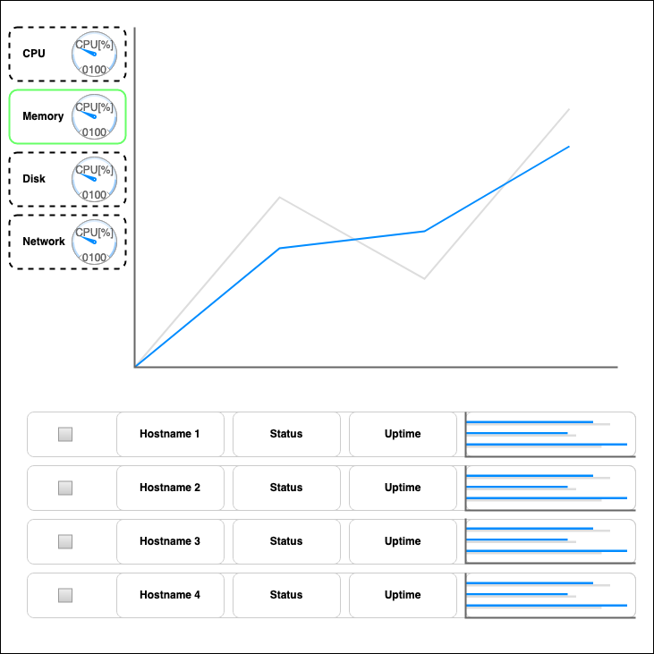

# Web-based UI

## Design Goals
    
The UI is designed to be portable, easy to use, and familiar to users. 
     

To achieve the goal of portability, we decided to use a web-based frontend for the UI. This allows users to get to their information just using their web-browser of choice, and requires no investment in porting the UI code to platform specific distributions. 
    

One of the main design points of the application is the distributed nature of the monitoring, so we took inspiration from the Kubernetes Dashboard with regard to the host table. The hosts will be listed along the bottom of the UI as seen above. The checkboxes will allow users to select which hosts they'd like to see data for on the main display on the top half of the UI. Overlaying different hosts data will be done different lines on the main line chart. This will allow users to easily compare data across multiple hosts. Each row in the hosts table will also display information about the host, such as uptime, current state, and a small graphic with utilization data. 
    

The top half of the UI is inspired by the Microsoft Task Manager. This UI is highly effective and familiar to most users. The tabs on the left of the screen allow users to switch between the different metrics, containing a small thumbnail preview of the data, while the main chart will display that data over time. 
    
    
## Features 

#### Selectable Metrics
- Each metric can be displayed seperately
- All data metrics will be updated via Asynchonous JavaScript Actions (AJAX) 
    
    
#### Overlay of Multi-Host Data
- Main graph will optionally contain data for more than one host
- Data will likely be normalized to Host's resources along the Y axis to make the comparisons meaningful 
    
  
#### Host Table 
- Lists all hosts where the Daemon is runnig and collecting data
- Status: Current state of the machine/daemon (online, offline, other)
- Uptime: Duration the Daemon has been alive and running
	- If the Daemon is tied to a Startup Process, this will corespond to the uptime of the machine
- Graphic: Will represent some composite metric of 'utilization' normalized as a percentage, represented by a bar
    

## Implementation Details

#### Page Layout
- HTML5 used for the page structure definition 
- Allows us to leverage dynamic features, such as canvases 
- Will use Bootstrap, a popular CSS/JS/HTML5 Library that provides native structures
- Bootstrap also uses a grid system for defining layouts, which will make it easy to define the structure of the page
- The native scaling of Bootstrap will also help achieve the design goals of portability, making it easy to define different aspect ratios 
    
  
#### Charts Implementation
- Charts will be defined using BokehJS, a library with a Python counterpart
- BokehJS provides a number of charts that can be rendered via HTML5 Canvases
- This allows us to define datastructures in Python to pass through to the frontend as JSON
- The JSON is rendered by BokehJS function calls into charts, which are then placed into the Canvas tags on the page
- Scaling is native, so leveraging the div structure on the page with CSS, we can create small charts to fix in Thumbnails

## Libraries and Depdenencies

#### BokehJS
[https://docs.bokeh.org/en/latest/docs/dev_guide/bokehjs.html]
    
  
#### Bootstrap4
[https://getbootstrap.com/docs/4.4/getting-started/introduction/]

## Accessibility and Globalization

#### Globalization Concerns
- We won't be providing localizations for languages
- Instead we will use Iconography that makes it easy to differentiate the metrics 
- With good Iconography, users will still be able to interpret the data meaningfully
- We will also leverage modern browser translation support by exposing the text direction to the browser
    
  
#### Accessibility Concerns
- Accessibility when providing charts is a key concern
- Selecting Elements on the Page
	- Often teams make the mistake of using colors to differentiate "Selected" vs "Not Selected" on a page
	- As seen in the above mockup, we'll differentiate this using the border shape instead (i.e. Dashed vs Solid)
- Viewing Data on the Charts
	- When displaying the data, bad color selection can lead to difficulty for users to view the data
	- This can especially occur when overlayingd data from multiple sources (such as multiple hosts)
	- To address this, BokehJS has an extensive color pallette selection, including a 'colorblind' pallette ([https://docs.bokeh.org/en/latest/docs/reference/palettes.html])

